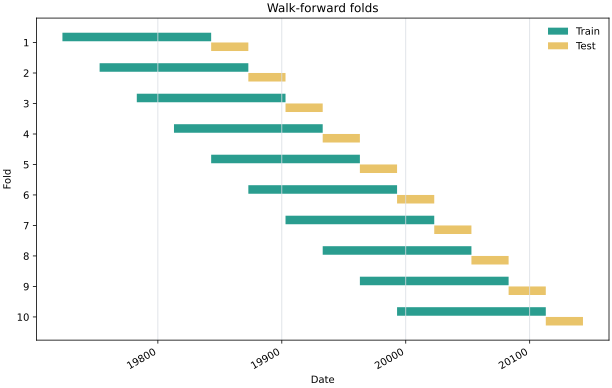

# walk-forward-validator

Version 0.3.0.

Walk-forward splits that will not let your backtest cheat.



Most time-series backtests leak by validating on data that touches or precedes the training
window. This package does one small thing: generate rolling or expanding pandas folds where
`train.index.max() < val.index.min()` is asserted before anything is yielded.

## Install

```bash
pip install walk-forward-validator
```

Plotting is optional:

```bash
pip install "walk-forward-validator[viz]"
```

## 30-second usage

```python
import pandas as pd
from walkforward import WalkForward

wf = WalkForward(train_days=365, val_days=90, step_days=30)
df = pd.read_csv("example.csv", parse_dates=["timestamp"], index_col="timestamp")

for train, val in wf.split(df):
    assert train.index.max() < val.index.min()
```

## Purged CV

For overlapping labels or features that look back across several bars, use purged splits.
`purge` removes bars between the train and test windows. `embargo` skips bars after each
test window before the next test window can start.

```python
from walkforward import PurgedWalkForwardSplit

splitter = PurgedWalkForwardSplit(train_size=365, test_size=90, purge=5, embargo=2)

for train_idx, test_idx in splitter.split(df):
    train = df.iloc[train_idx]
    test = df.iloc[test_idx]
    assert train.index.max() < test.index.min()
```

## Plotting

`fold_plot` returns a matplotlib `Figure`. The preview SVG in this README is generated
with the same helper.

```python
from walkforward import fold_plot, walk_forward_split

splits = walk_forward_split(df, train_days=365, val_days=90, step_days=90)
fig = fold_plot(splits)
fig.savefig("screenshots/folds_preview.svg")
```

## Metrics

`fold_stability` summarizes fold score mean/std, train-vs-test degradation percentage,
and a simple overfit flag.

```python
from walkforward import fold_stability

report = fold_stability({"train": train_scores, "test": test_scores})
print(report["degradation_pct"], report["overfit"])
```

## Combinatorial purged CV (CPCV)

A single walk-forward backtest gives you **one** out-of-sample path, so its
Sharpe/return estimate is noisy and easy to overfit. `CombinatorialPurgedSplit`
(López de Prado's CPCV) cuts the series into `n_groups` contiguous blocks, holds
out every combination of `test_groups` blocks as a test set, and reuses the same
purge + embargo logic to kill leakage. That yields `C(n_groups, test_groups)`
splits and `C(n_groups, test_groups) * test_groups / n_groups` reconstructed
backtest **paths** — so you can study the *distribution* of a metric instead of
trusting one number.

```python
from walkforward import CombinatorialPurgedSplit

splitter = CombinatorialPurgedSplit(n_groups=6, test_groups=2, purge=5, embargo=2)

# C(6, 2) = 15 purged splits, all leak-free.
for train_idx, test_idx in splitter.split(df):
    train, test = df.iloc[train_idx], df.iloc[test_idx]

# 5 backtest paths that each tile the whole series exactly once.
for path in splitter.paths(df):
    for train_idx, test_idx in path:
        ...  # score this block, then aggregate per path
```

## HTML report

`build_report` returns a single self-contained HTML string (pure string
templating, no JavaScript, no external links) with the fold/path bands, the
`fold_stability` metrics table, and a CPCV path-distribution summary. The
matplotlib chart is embedded inline as a base64 PNG when the `[viz]` extra is
installed, and degrades to a note without it — so the file always works offline.

```python
from walkforward import CombinatorialPurgedSplit, fold_stability, write_report

splitter = CombinatorialPurgedSplit(n_groups=6, test_groups=2, purge=5)
pairs = [(df.iloc[tr], df.iloc[te]) for tr, te in splitter.split(df)]

write_report(
    "report.html",
    pairs,
    title="CPCV run",
    metrics=fold_stability(test_scores),
    path_distribution={"n_paths": splitter.get_n_paths()},
)
```

## Arguments

| Arg | Meaning |
|---|---|
| `train_days` | Training window length. |
| `val_days` | Validation window length. |
| `step_days` | Days to advance between folds. |
| `expanding` | Keep `train_start` pinned to the series start. |

The public API is intentionally tiny: `Fold`, `walk_forward_split`, `WalkForward`, and
`classify_robustness`, plus `PurgedWalkForwardSplit`, `CombinatorialPurgedSplit`,
`fold_plot`, `fold_stability`, and `build_report` / `write_report`.

Used inside **[confluence-scanner](https://github.com/barobaonguyen/confluence-scanner)**.

Built by [barobaonguyen](https://github.com/barobaonguyen). Want the full **scrape -> AI -> alert** bot, not just this piece? -> **[Trawlkit](https://github.com/barobaonguyen)** (one-time kit).
